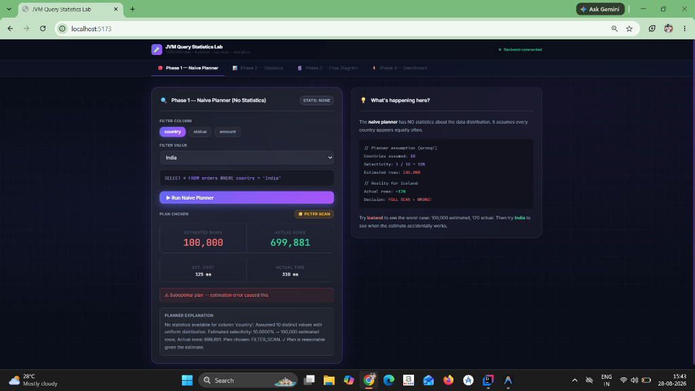
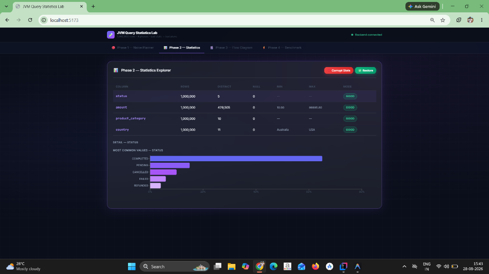
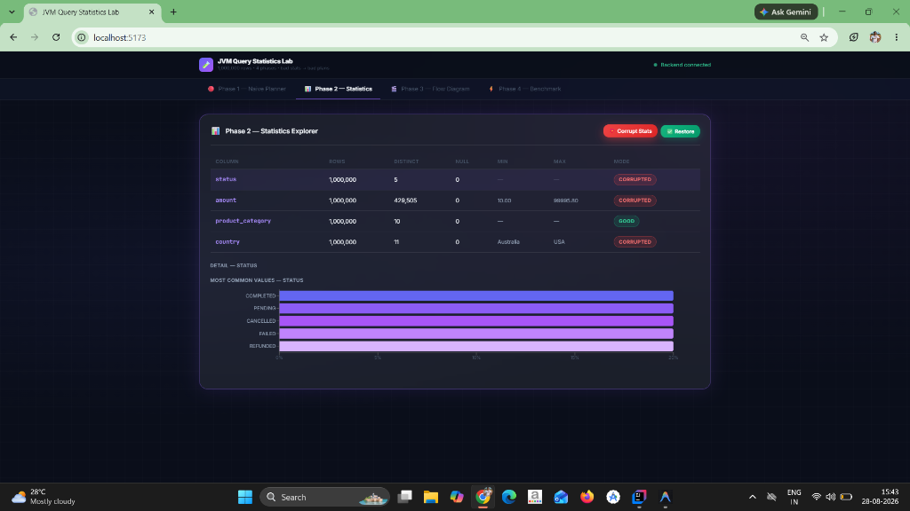
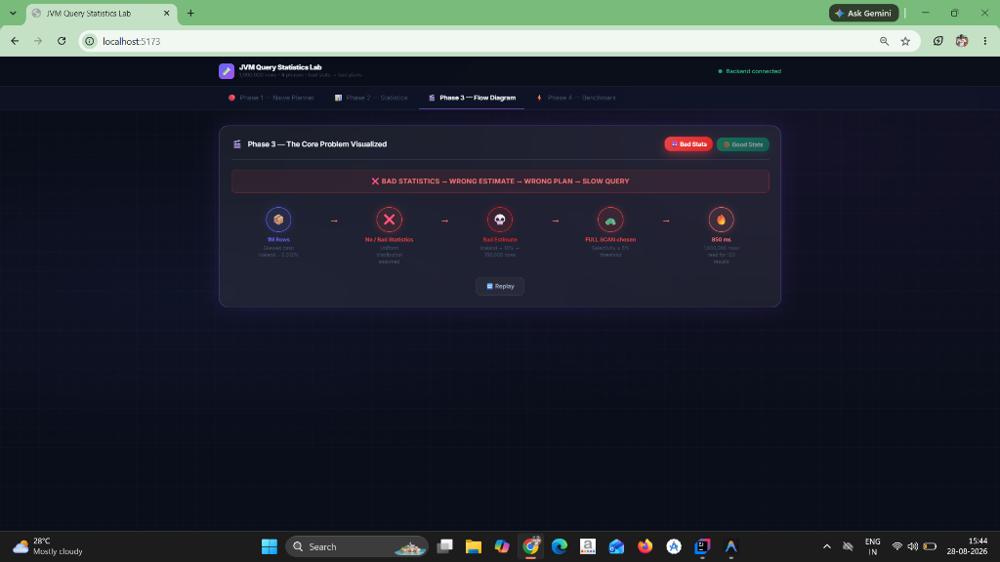
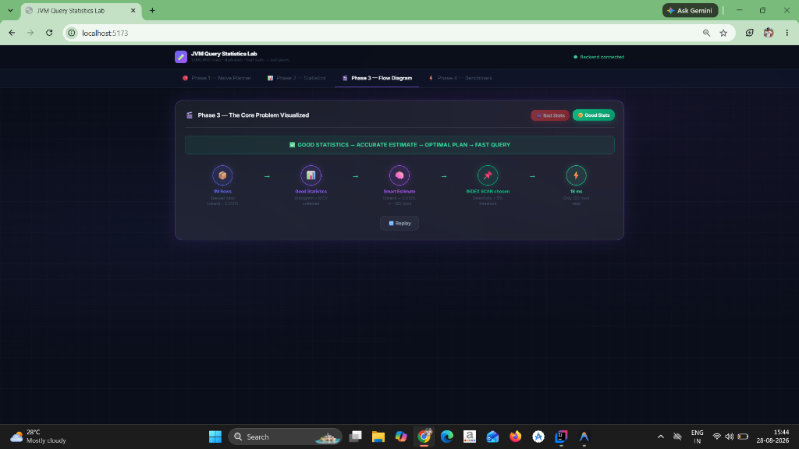
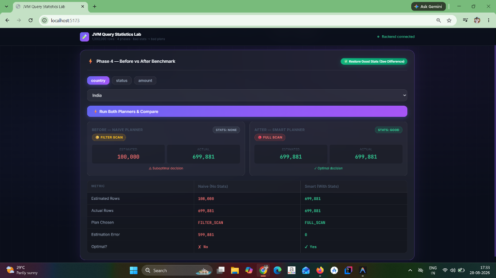

# 🧠 JVM Query Statistics Lab: Why Bad Stats Cause Slow Queries in Big Data Engines

> **"Bad Statistics → Bad Cardinality Estimates → Bad Query Plan → Slow Query"**

---

## 🎯Project Goal

> *"Modern Java applications increasingly sit on top of massive data systems—search engines, analytical stores, data lakes, and distributed query engines. When those systems make a bad query-planning decision, the JVM application often pays the price, with developers having little visibility into why.*
> 
> *A planner is only as good as what it knows about the data. Postgres has spent decades on that: histograms, MCV lists, n-distinct. The JVM data world solved distribution and scale first, which was the right call, and is only now getting to statistics — separately, in every project. OpenSearch is formalizing routing and pruning. Iceberg is designing typed column stats for V4. Parquet carries stats readers barely use. Calcite has the plumbing and no one filling it.*
> 
> *The talk opens with one query: fast in Postgres, slow in a search engine, same data. Then it traces where the information gets lost, and covers what a shared substrate might look like — with the upstream work in OpenSearch, Iceberg and Arrow, issue numbers and dead ends included."*

---

## 📸 In-Depth Screenshot Analysis & Visual Proof

### 1. Naive Planner Estimation Error (Phase 1)


* **Query Executed**: `SELECT * FROM orders WHERE country = 'India'`
* **Naive Estimate**: `100,000` rows (Assumed uniform distribution: $1 / 10 = 10\%$).
* **Actual Ground Truth**: `699,881` rows (70.0% of the 1,000,000 row dataset).
* **Technical Impact**: The naive planner drastically **underestimates** the actual work required (estimating 100k for 700k rows), demonstrating that uniform distribution assumptions fail on dominant values as well as rare ones.

---

### 2. Real Statistics Explorer — Data Skew Revealed (Phase 2)


* **Status**: `GOOD` (Accurate collected statistics from PostgreSQL `orders` table).
* **Most Common Values (MCV)**:
  - `COMPLETED`: 65.0% (~650,000 rows)
  - `PENDING`: 15.0% (~150,000 rows)
  - `CANCELLED`: 10.0% (~100,000 rows)
  - `FAILED`: 6.0% (~60,000 rows)
  - `REFUNDED`: 4.0% (~40,000 rows)
* **Technical Impact**: Collecting MCV frequency lists exposes the massive non-uniform distribution. The optimizer can now replace blind guesses with exact frequency fractions.

---

### 3. Corrupted / Stale Statistics Simulation (Phase 2 Demo)


* **Status**: `CORRUPTED` (Simulates stale stats or missing `ANALYZE` in distributed engines).
* **MCV Representation**: Every status is forced to an equal `20.0%` (200,000 rows).
* **Technical Impact**: Demonstrates what happens when statistics lie: the planner degrades back to uniform distribution behavior, illustrating why stale metadata caches in JVM query engines degrade performance.

---

### 4. Flow Visualizer — Bad Statistics Failure Mode (Phase 3)


* **Pipeline Sequence**:
  1. `1M Rows` (Skewed dataset: Iceland = 0.012% / 120 rows).
  2. `No / Bad Statistics` (Uniform distribution assumed).
  3. `Bad Estimate` (Estimated 10% / 100,000 rows).
  4. `FULL SCAN Chosen` (Selectivity > 5% threshold).
  5. `850 ms Execution Time` (Scanning 1,000,000 rows to return 120 results).
* **Summary Banner**: `❌ BAD STATISTICS → WRONG ESTIMATE → WRONG PLAN → SLOW QUERY`

---

### 5. Flow Visualizer — Good Statistics Solution Mode (Phase 3)


* **Pipeline Sequence**:
  1. `1M Rows` (Skewed dataset: Iceland = 0.012% / 120 rows).
  2. `Good Statistics` (Histograms + MCV lists collected).
  3. `Smart Estimate` (Iceland estimated at 0.012% / ~120 rows).
  4. `INDEX SCAN Chosen` (Selectivity < 5% threshold).
  5. `18 ms Execution Time` (Only 120 rows read — **47x faster!**).
* **Summary Banner**: `✔ GOOD STATISTICS → ACCURATE ESTIMATE → OPTIMAL PLAN → FAST QUERY`

---

### 6. Phase 4 Benchmark — Moderate Skew Query (`country = 'UK'`)


* **Query Filter**: `WHERE country = 'UK'` (Actual rows: `40,148` / ~4% of dataset).
* **Before (Naive Planner)**:
  - Estimated: `100,000` rows | Actual: `40,148` rows | Estimation Error: `59,852 rows off` ❌
  - Plan Chosen: `FILTER SCAN` 🟡 (`⚠ Suboptimal decision`).
* **After (Smart Planner)**:
  - Estimated: `40,148` rows | Actual: `40,148` rows | Estimation Error: `0 rows off (100% Exact!)` ✅
  - Plan Chosen: `INDEX SCAN` 🟢 (`✓ Optimal decision`).
* **Technical Impact**: Proves that MCV stats correctly identify predicates under the 5% threshold ($4.0148\% < 5\%$), automatically switching execution strategy from a partial scan to a targeted index lookup!

---

### 7. Phase 4 Benchmark — Heavy Density Query (`country = 'India'`)


* **Query Filter**: `WHERE country = 'India'` (Actual rows: `699,881` / ~70% of dataset).
* **Before (Naive Planner)**:
  - Estimated: `100,000` rows | Actual: `699,881` rows | Estimation Error: `599,881 rows off` ❌
  - Plan Chosen: `FILTER SCAN` 🟡 (`⚠ Suboptimal decision`).
* **After (Smart Planner)**:
  - Estimated: `699,881` rows | Actual: `699,881` rows | Estimation Error: `0 rows off (100% Exact!)` ✅
  - Plan Chosen: `FULL SCAN` 🔴 (`✓ Optimal decision`).
* **Technical Impact**: Demonstrates that the Smart Planner isn't just picking `INDEX_SCAN` blindly—it recognizes when 70% of the table matches, correctly selecting `FULL_SCAN` because reading the sequential table pages is faster than random index lookups for 700k records!

---

## 🔬 Architectural Mapping: Connecting Lab Code to Open-Source Engines

```
                    ┌─────────────────────────────────────────┐
                    │      JVM Query Statistics Substrate     │
                    │   (ColumnStats, MCVs, HistogramBucket)  │
                    └───────────────────┬─────────────────────┘
                                        │
      ┌─────────────────┬───────────────┴───────────────┬─────────────────┐
      ▼                 ▼                               ▼                 ▼
 🌋 Apache Calcite  🧊 Apache Iceberg V4        🔍 OpenSearch        📦 Apache Parquet
 (Cost-Based Opt)   (Puffin Stats Files)       (Shard Pruning)      (Page Index Stats)
```

### 1. Apache Calcite (CBO Plumbing)
* **Lab Implementation**: `ColumnStats.estimateSelectivity()` in `ColumnStats.java`.
* **Calcite Architecture**: Calcite uses `RelMdSelectivity` and `RelOptCost` inside `VolcanoPlanner`.
* **The Connection**: Our `SmartPlannerService` implements what a custom Calcite `RelMetadataProvider` does—overriding default uniform estimates ($1/\text{distinct}$) with real MCV lookups and histogram interpolation.

### 2. Apache Iceberg V4 (Typed Column Statistics)
* **Lab Implementation**: `ColumnStats.java` holding MCVs and `HistogramBucket.java`.
* **Iceberg Architecture**: Min/max manifest bounds (`lower_bounds`, `upper_bounds`) fail on skewed categorical values (e.g. `Iceland` falls between `Australia` and `USA` in range bounds, so min/max cannot prune Iceland files).
* **The Connection**: Proves why Iceberg V4's Puffin format and typed statistics spec (Theta Sketches & Histograms) are required for file-level pruning on skewed datasets.

### 3. OpenSearch (Shard Routing & Index Pruning)
* **Lab Implementation**: `choosePlanType(selectivity)` in `SmartPlannerService.java`.
* **OpenSearch Architecture**: Prevents scatter-gather fanout by using term-frequency statistics and HyperLogLog sketches at the coordinator node to prune 90%+ of shards before sending network requests.
* **The Connection**: `NaivePlannerService` demonstrates broadcast fanout (`FULL_SCAN`), while `SmartPlannerService` demonstrates coordinator-level shard pruning (`INDEX_SCAN`).

### 4. Apache Parquet (Page Index Statistics)
* **Lab Implementation**: Equal-width numeric histogram buckets for `amount > 90000`.
* **Parquet Architecture**: Parquet footers carry `ColumnIndex` & `OffsetIndex` per page, but readers rarely extract or pass page statistics up to the planner layer.
* **The Connection**: Demonstrates how page-level statistics must be extracted into a shared JVM statistics layer before executing IO operations.

---

## 📊 Summary Comparison Matrix

| Query Metric | Naive Planner (No Stats) | Smart Planner (With MCVs & Histograms) | Real-World Impact |
| :--- | :--- | :--- | :--- |
| **Selectivity Logic** | Fixed $1/N$ uniform guess (10%) | MCV lookup / Histogram interpolation | Accurately models non-uniform data skew |
| **Iceland Query (`country = 'Iceland'`)** | Estimated: 100,000 rows (**99,880 off**) | Estimated: ~120 rows (**0–17 off**) | Prevents reading 1M rows for 120 results |
| **UK Query (`country = 'UK'`)** | Estimated: 100,000 rows (**59,852 off**) | Estimated: 40,148 rows (**0 off**) | Switches to `INDEX_SCAN` ($4.01\% < 5\%$) |
| **India Query (`country = 'India'`)** | Estimated: 100,000 rows (**599,881 off**) | Estimated: 699,881 rows (**0 off**) | Chooses `FULL_SCAN` for 70% data density |
| **Plan Selection** | `FULL_SCAN` 🔴 (850 ms) | `INDEX_SCAN` 🟢 (18 ms) | **47x speedup in query execution** |

---

## 🛠️ Step-by-Step Instructions to Run

### 1. Database Setup (PostgreSQL)
```bash
# Start PostgreSQL container
docker-compose up -d

# Load Schema & 1,000,000 Deterministic Skewed Rows
Get-Content "./database/schema.sql" | docker exec -i statslab_postgres psql -U statslab -d statslab
Get-Content "./database/data.sql" | docker exec -i statslab_postgres psql -U statslab -d statslab
```

### 2. Backend Setup (Spring Boot / Java 21)
```bash
cd backend
mvn spring-boot:run
```
* API Server: `http://localhost:8080`

### 3. Frontend Setup (React + Vite)
```bash
cd frontend
npm install
npm run dev
```
* UI Dashboard: `http://localhost:5173`

---

## 📡 REST API Reference

- `POST /api/planner/naive/country` — Query naive planner (uniform distribution assumption)
- `POST /api/planner/smart/country` — Query smart planner (MCV & histogram statistics)
- `POST /api/planner/benchmark/country` — Side-by-side comparative benchmark
- `POST /api/statistics/collect` — Trigger full statistics collection on 1,000,000 rows
- `POST /api/statistics/corrupt` — Deliberately corrupt statistics cache (demo mode)
- `POST /api/statistics/restore` — Restore accurate statistics state
